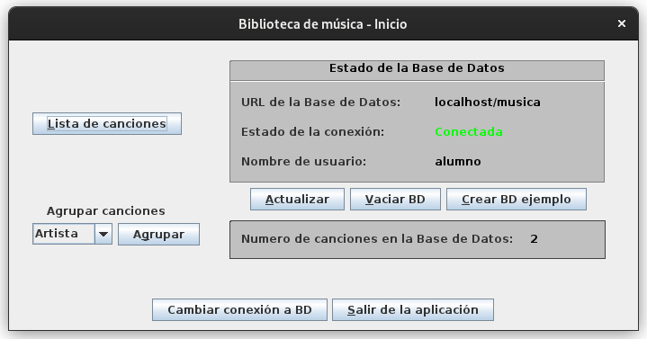
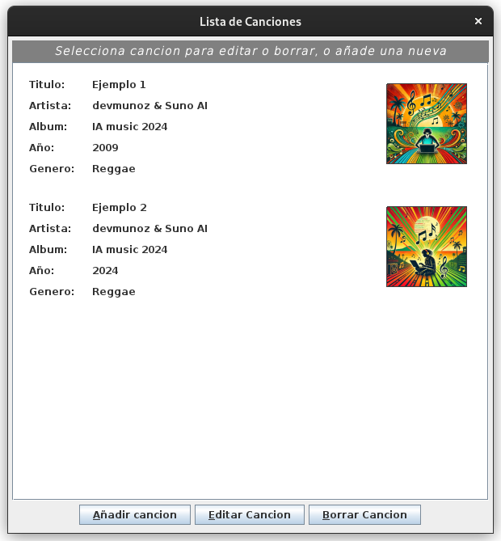
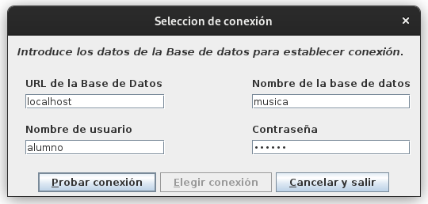

# Música 🎵

###### Last update: 12/2024

#### My first Java project as a developer, 8 years ago 😿

## Description

This application is a music library GUI built with Java Swing and connected to a MySQL database via JDBC driver.

The application allows to store, view, edit, and group songs in a very simple way.

The database is too simple, consisting of only one table named 'songs', where song metadata, album cover, and mp3 file are stored (yes, a blob in the database... it was my first project 😕) .

## Screenshots








## Installation and Execution

- Prerequisites:
  - Install JRE on your machine following the instructions on [java.com](https://www.java.com/en/download/help/index_installing.html)
  - Install Docker and Docker Compose following the instructions on [docs.docker.com](https://docs.docker.com/get-started/get-docker/)
- Run MySQL (with Docker 🚀️)
  - Go to the directory where the Docker container files are located:
  ```
  cd Musica/mysql-docker
  ```
  - Build and run the Docker container
  ```
  docker compose up -d
  ```
- Compile the Java project
  ```
  ./compile.sh
  ```
- Run it 😄
  ```
  ./run.sh
  ```

## Contribution

Feel free! Receiving updates here will be strange but amazing!

## License

This project is licensed under the MIT License. See the LICENSE file for more details.