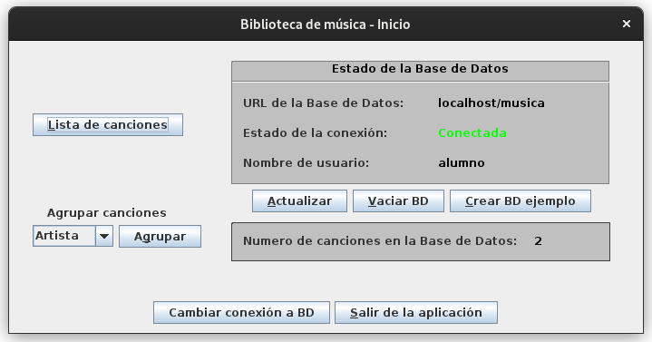
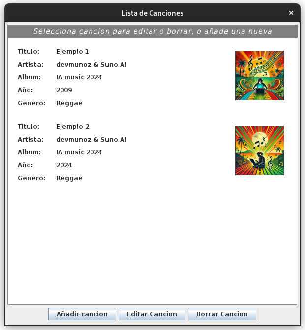
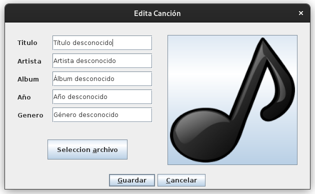

###### last update: 12/2024

# Música 🎵

#### Mi primer proyecto como desarrollador en Java, hace 8 años 😿

## Descripción

Es una GUI de una biblioteca de música, hecha con java Swing y conectada a una base de datos mysql mediante JDBC.

Permite almacenar, visualizar, editar y agrupar de una forma muy simple canciones.

Su base de datos es tan simple que solo tiene una tabla llamada 'canciones', donde se almacenan los metadatos de las canciones, su carátula y el archivo mp3 (sí, blob en base de datos... era mi primer proyecto 😕)

## Capturas de pantalla








## Instalación y ejecución

* Pre-requisitos:

  * Instala JRE en tu equipo siguiendo las instrucciones en [java.com](https://www.java.com/es/download/help/index_installing.html)
  * Instala docker y docker compose siguiendo las instrucciones en [docs.docker.com](https://docs.docker.com/get-started/get-docker/)
* Ejecuta MySQL (con Docker 🚀️)

  * Ve al directorio donde se encuentran los ficheros del contenedor de docker:

  ```
  cd Musica/mysql-docker
  ```

  * Ejecuta construye y ejecuta el contenedor docker

  ```
  docker compose up -d
  ```
* Compila el proyecto java

  ```
   ./compile.sh
  ```
* Ejecútalo 😄

  ```
   ./run.sh
  ```

## Contribución

Siéntete libre! Recibir actualizaciones aquí sería raro pero increible!

## Licencia

Este proyecto está bajo la licencia MIT. Consulte el archivo LICENSE para obtener más detalles.
